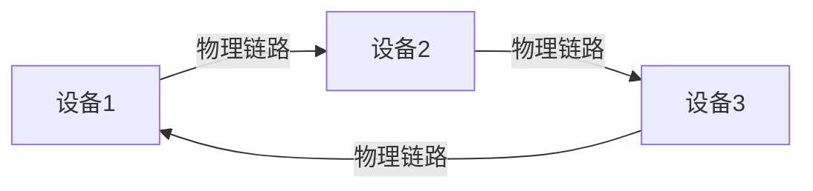
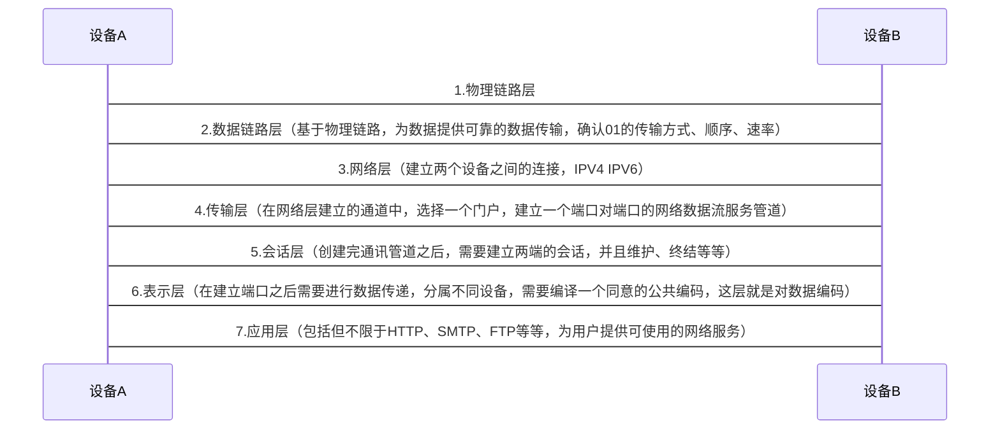

# 网络七层模型

1. 物理层
   物理层负责将最后的信息编码转化成电流脉冲或者其他电信号用于传输，也就是对应的硬件支持
2. 数据链路层
   基于物理链路，为数据传输提供可靠的传输服务，对传输数据进行维护，数据帧的形式、传输的顺序、速率等等
3. 网络层
   确定源点和目标点的连接，可以理解为寻址
4. 传输层
   传输层向高层提供可靠的端口对端口的可靠传输服务
5. 会话层
   会话的建立、管理、终结表示层和实体之间的通信会话
6. 表示层
   为数据做编码和转化，确定数据的格式也就是表达形式，加密、编码
7. 应用层
   也就是我们所熟知的网络协议，包括但不限于HTTP、FTP、SMTP等
---

**1. 应用层:** 应用层确定进程之间通信的性质，以满足用户的需要。应用层不仅要提供应用进程所需要的信息交换和远程操作，而且还要作为应用进程的用户代理，来完成一些为进行信息交换所必需的功能。

**2.表示层:** 主要用于处理两个通信系统中交换信息的表示方式。为上层用户解决用户信息的语法问题。它包括数据格式交换、数据加密与 
解密、数据压缩与终端类型的转换。

**3. 会话层:** 在两个节点之间建立端连接。为端系统的应用程序之间提供了对话控制机制。此服务包括建立连接是以全双工还是以半双工的方式进行设置，尽管可以在层4中处理双工方式;会话层管理登入和注销过程。它具体管理两个用户和进程之间的对话。如果在某一时刻只允许一个用户执行一项特定的操作，会话层协议就会管理这些操作，如阻止两个用户同时更新数据库中的同一组数据。

**4. 传输层:** 一堂规数据递送一面向连接或无连接，为会话展用户提供一个端到端的可靠，透明和优化的数据传输服务机制。包括全双工或半双工、流控制和错误恢复服务;传输层把消息分成若干个分组，并在接收端对它们进行重组。不同的分组可以通过不同的连接传送到主机。这样既能获得较高的带宽，又不影响会话层。在建立连接时传输层可以请求服务质量，该服务质量指定可接受的误码率、延迟量、安全性等参数，还可以实现基于端到端的流量控制功能。

**5. 网络层:** 本层通过寻址来建立两个节点之间的连接，为源端的运输层送来的分组，选择合话的路由和交换节点，正确无误地按照地址传送给目的端的运输层。它包括通过石连网络来路由和中继数据:除了选择路由之外，网络层还负责建立和维护连接，控制网络上的拥塞以及在必要的时候生成计费信息。常用设备有交换机。

**6. 数据链路层:** 在此层将数据分帧，并外理流控制。屏蔽物理展，为网络层提供一个数据链路的连接，在一条有可能出差错的物理连接上，进行几乎无差错的数据传输(差错控制)。本层指定拓扑结构并提供硬件寻址。常用设备有网卡、网桥、交换机。

**7. 物理层:** 处于OSI参考模型的最底层。物理层的主要功能是利用物理传输介质为数据链路层提供物理连接，以便透明的传送比特流。常 
用设备有(各种物理设备)集线器、中继器、调制解调器、网线、双绞线、同轴电缆。